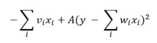

# DQM Implementation of the Knapsack Problem

The knapsack problem is a common optimization problem. In it, we have a knapsack or some form of container and a list of items as well as their weights and values. The knapsack has a maximum weight which it can carry. The goal is to maximize the total value of the items placed into the knapsack without going over the weight limit. There are many different variations of the problem. In our version, there was a list of items with their associated weights and costs as well as the integer quantity of each available item. 

The knapsack problem is an especially common and useful optimization problem, so there exists a lot of benefit if it could be run with a quantum speedup. We were very excited to try out implementing the problem on this new technology. Using the DQM solver was useful to discretize the variables in order to determine what quantity of each item to take. 

# Usage
To run a demo, run the command
```bash
python knapsack.py data/small.csv 50
```
where small.csv can be changed for very_small.csv or large.csv and 50 is the weight maximum.

# Code Overview
For our problem, we have the following Hamiltonian:



Where ```v_i``` = cost of item i, ```x_i``` = quantity of item i, ```A``` = Lagrange multiplier (scaling constant),  ```y``` = integer ranging from 1 to ```W``` where ```W``` is the maximum weight that we can carry, ```w_i``` = weight of item i.
We want to maximise our total cost that we can carry, the sum over i of ```v_i*x_i``` or in other words minimise the sum over i of ```-v_i*x_i``` subject to the constraint that the sum over i of ```w_i*x_i``` is equal to the total weight W. y ∈ {1,..., W} in the Hamiltonian so that we can carry W or W-1, or W-2,... items.
The ```x_i``` and ```y``` terms can be thought of as the state of qubits in the system. The constant factors in front of ```x_i``` and ```y``` are the bias terms, changing the probability amplitude of us measuring that state. The constant factor in front of the ```x_i*y``` term represents the coupling constant, which can be thought of as entangling two qubit states. Once the ground state is reached and a measurement is reached, the state collapses to our desired state, producing the solution.
# To Do

* Get the optimization to work. The code does not throw errors however, the optimization is not always correct.

# References

[1] Andrew Lucas, "Ising formulations of many NP problems", [doi:
10.3389/fphy.2014.00005](https://www.frontiersin.org/articles/10.3389/fphy.2014.00005/full)

